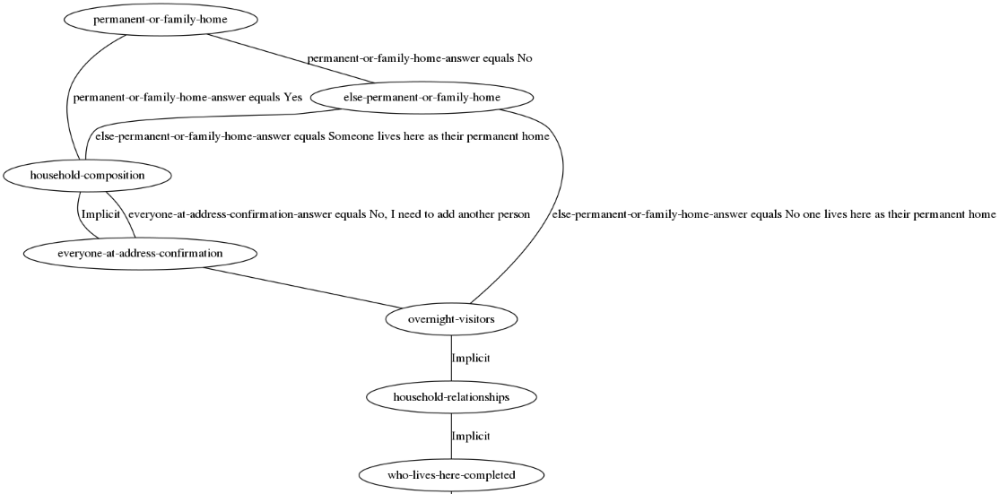

# route-visualiser

An utility for visualising routes through eQ survey runner surveys as a
connected graph of nodes and edges.

## Running with docker

```
docker build -t route-visualiser .
```

```
docker run -ti -p 5000:5000 route-visualizer
```

The route visualiser should then be running on `http://localhost:5000`.

## Service endpoints

| Route | Method | Description |
| ----- | ------ | ----------- | 
| /status | GET | Displays service status |
| /visualise?uri=%urlencoded publisher URL% | GET | Get the schema from arg and return an SVG. |
| /visualise | POST | Post JSON schema, get a SVG back. |

## Screenshot


